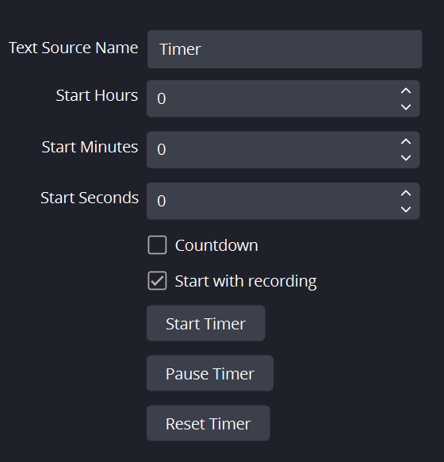

# OBS Timer Add-on

<!-- Make the image corners rounded -->

    

This is an OBS Studio add-on that adds a customizable timer to your stream or recording. It is built using Python and can be easily integrated into OBS Studio.

**Note:** This script requires Python 3.6 or higher to work properly.

## Features

- Configurable timer: Set the initial hours, minutes, and seconds.
- Countdown mode: Enable or disable the countdown mode.
- Start with recording: Automatically start the timer when the recording starts.
- Manually start, pause, and reset the timer.

## Installation

### Prerequisites

- Python 3.6 or higher installed on your system.
- OBS Studio 26.0 or higher installed on your system.

### Steps

1. Download the Python script from this repository.
2. In OBS Studio, go to `Tools` > `Scripts`.
3. Click the `+` button to add a new script and browse to the location where you downloaded the script.
4. Select the script file and click `Open`.

## Usage

1. Add a text source in OBS Studio with the name "Timer" (or any other name you prefer).
2. Configure the timer settings in the `Script` tab in OBS Studio.
3. Use the `Start Timer`, `Pause Timer`, and `Reset Timer` buttons to control the timer.

## Configuration

- `Text Source Name`: Name of the text source to be updated with the timer value.
- `Start Hours`: Initial value for hours.
- `Start Minutes`: Initial value for minutes.
- `Start Seconds`: Initial value for seconds.
- `Countdown`: Enable or disable countdown mode.
- `Start with recording`: Automatically start the timer when recording starts.

## License

This project is licensed under the MIT License. See [LICENSE](LICENSE) for more information.